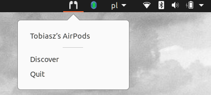

# quickblue
Shortcut for connecting to airpods from topbar, instead of navigating through settings.
As for now, it will look for devices that have "AirPods" in then (because this is what i wanted).
When a device is clicked, it will attempt to connect (if initially disconnected) or disconnect (if initially connected).
Upon clicking "Discover" it will look for devices. Quit will quit GTK app.

```commandline
nohup $DIR/quickblue.py &
```

